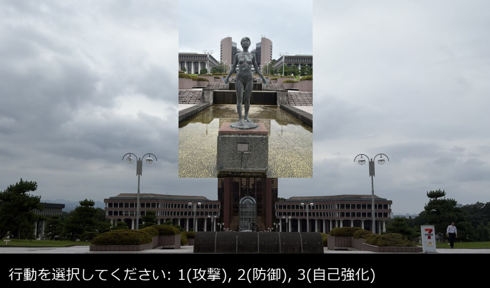

# 工科大RPG (Group12_Game)

## 実行環境の必要条件
* python >= 3.10
* pygame >= 2.1

## ゲームの概要
* プレイヤーがコマンドを選択して敵と戦ったり、イベントを進行していくRPG風のゲームです。
* 画面に背景を描画し、テキストメッセージを介して戦闘やランダムなイベント（戦闘・宝箱など）を処理します。

## ゲームの遊び方
* イベントシーンで行動（戦闘をするか、宝箱を取るか）を選択します。
* 戦闘では、プレイヤーはコマンド（1:攻撃、2:防御、3:自己強化）を入力して敵と戦います。
* 敵の攻撃を受けてプレイヤーのHPが0になったらゲームオーバーです。
* ※※※※※コマンド入力時に連打や長押しをしないでください※※※※※

## ゲームの実装
### 共通基本機能
* 背景画像の描画およびシーン遷移の管理（メインループ）

### 分担追加機能
* 戦闘or宝箱選択機能(担当:森):90%で戦闘のみの選択肢を表示、10%で戦闘と宝箱の選択肢の表示、Fキーで戦闘を選択、Tキーで宝箱を選択、宝箱を選択後再度戦闘or宝箱の選択
* 画面にメッセージを表示するクラスの追加(担当:西本)
* 宝箱を開ける操作を追加(担当:西本)
* `player`クラスにおいて、プレイヤーキャラクターの行動管理とコマンド処理（担当：田中）
* 敵撃破後のボーナス(ステータスランダム上昇・回復)（担当：生田）
* 敵の実装・ゲームオーバー画面の実装・倒した敵のカウント(担当:稲垣)

### メモ
* メインループ内で `scene` 変数を用いて、シーン（スタート、自ターン、敵ターン、戦闘終了など）の切り替えを行っています。
* 3体の敵を作り、どれか一体が確率で出現するようにした。
* 背景画像の描画およびシーン遷移の管理（メインループ）
* バトル終了後のステータスアップの処理。class Bonusの追加　アタックを3~5で上昇、HPを5~15で上昇、HPを10~20回復（上限は超えないように）を作成した。
* 戦闘終了後に Event() を生成し、90%/10% の選択肢が決まる。
* Event.select() は毎フレーム呼ばれる。
* finish_battle の後は必ず scene = "select_action" に進む。
* 宝箱処理が終わったら treasure_chest シーン側で scene = "select_action" に戻すこと。
* Event.select() は Event インスタンスを使う仕様。